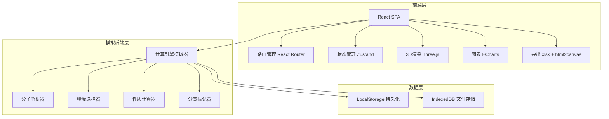
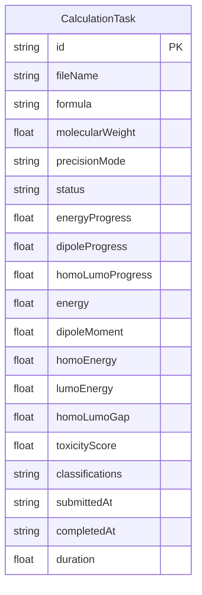

## 1. 架构设计



## 2. 技术说明

- 前端：React@18 + TypeScript + TailwindCSS@3 + Vite
- 初始化工具：Vite (react-ts template)
- 3D渲染：Three.js + @react-three/fiber + @react-three/drei
- 图表：ECharts (echarts + echarts-for-react)
- 状态管理：Zustand
- 路由：React Router@6
- 导出：xlsx (Excel导出) + html2canvas (图片导出)
- 后端：无（纯前端模拟，使用定时器模拟计算过程）
- 数据库：LocalStorage + IndexedDB（浏览器端持久化）

## 3. 路由定义

| 路由 | 用途 |
|------|------|
| / | 分子上传页 - 文件上传、格式校验、原子组成识别 |
| /compute/:id | 计算中心页 - 实时进度、消息通知 |
| /history | 历史任务页 - 任务列表、筛选排序、删除 |
| /result/:id | 结果详情页 - 结构图、数值、分类标签、报表导出 |
| /dashboard | 统计看板页 - 计算量、耗时、分子占比统计 |

## 4. API 定义（模拟层）

```typescript
interface AtomInfo {
  symbol: string
  name: string
  count: number
  mass: number
  isHeavyMetal: boolean
}

interface MoleculeParseResult {
  formula: string
  atoms: AtomInfo[]
  molecularWeight: number
  containsHeavyMetal: boolean
  precisionMode: 'standard' | 'high'
}

interface CalculationTask {
  id: string
  fileName: string
  formula: string
  molecularWeight: number
  precisionMode: 'standard' | 'high'
  status: 'pending' | 'computing' | 'completed' | 'failed'
  progress: {
    energy: number
    dipole: number
    homoLumo: number
  }
  result?: CalculationResult
  submittedAt: string
  completedAt?: string
  duration?: number
}

interface CalculationResult {
  energy: number
  dipoleMoment: number
  homoEnergy: number
  lumoEnergy: number
  homoLumoGap: number
  toxicityScore: number
  classifications: string[]
}

interface DailyStats {
  date: string
  taskCount: number
  avgDuration: number
  moleculeTypes: {
    organic: number
    inorganic: number
    metalContaining: number
  }
}
```

## 5. 数据模型

### 5.1 数据模型定义



### 5.2 数据定义

- 使用 Zustand + persist 中间件将任务数据持久化到 LocalStorage
- 文件内容存储到 IndexedDB（通过 idb-keyval 库）
- 键值设计：`molcalc:tasks` 存储任务列表 JSON，`molcalc:file:{id}` 存储上传文件内容
